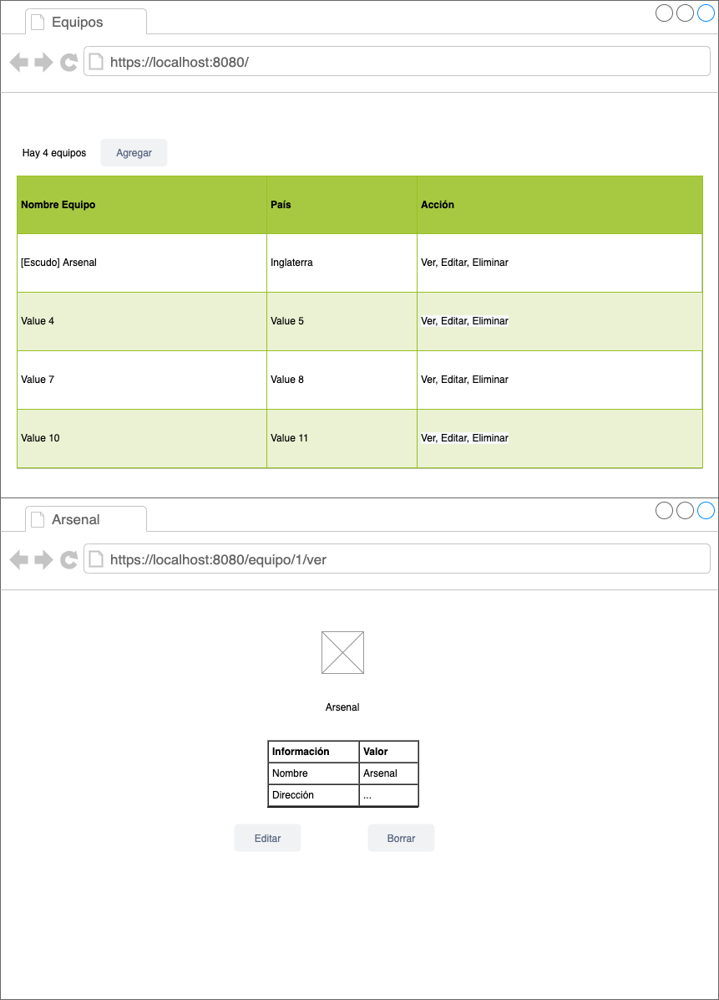

# Introducción a Node.js

[Documento de la clase](https://docs.google.com/document/d/1MDumJORAgOktqtYv8zUnp1-KixNp7AxKiG4C5CeUxQ0/edit)


## Herramientas requeridas

* [cUrl](https://curl.haxx.se/)
* [Postman](https://www.postman.com/)

## Tarea 1

En un repo propio (sugiero el nombre crud-clubes -crud = create, retrieve, update, delete-), Crear una aplicación donde se puedan crear, consultar, actualizar y eliminar equipos en Inglaterra usando express + handlebars.

Seguiremos el formato de football-data.org

```json
 {
   "id": 57,
   "area": {
     "id": 2072,
     "name": "England"
   },
   "name": "Arsenal FC",
   "shortName": "Arsenal",
   "tla": "ARS",
   "crestUrl": "https://upload.wikimedia.org/wikipedia/en/5/53/Arsenal_FC.svg",
   "address": "75 Drayton Park London N5 1BU",
   "phone": "+44 (020) 76195003",
   "website": "http://www.arsenal.com",
   "email": "info@arsenal.co.uk",
   "founded": 1886,    
   "clubColors": "Red / White",
   "venue": "Emirates Stadium",
   "lastUpdated": "2020-05-14T02:41:34Z"
 }
```

* la aplicación debe mostrar un listado de equipos.
* la aplicación debe poder crear equipos nuevos (incluyendo el logo).
* la aplicación debe poder editar equipos existentes (incluyendo el logo).
* la aplicación debe (previa confirmación en el frontend) poder eliminar equipos.
* la aplicación debe poder mostrar un equipo en detalle.
* punto bonus: con la dirección, en la página de detalle de equipo, mostrar un mapa de google maps.

```
Tip: el método de persistencia es un archivo .json
```
```
Tip: crestUrl (la imagen), la tienen que poder subir desde el formulario y guardarla en el servidor.
```
```
Tip: el archivo equipos.db.json (dejar equipos.json como referencia) contendrá JSON dentro, es decir que se puede leer, interpretar y manipular como un objeto (agregarle o quitarle registros, por ejemplo) y luego se puede volver a guardar.
```

### Mockup de la aplicación

Una ayuda para empezar a pensar la aplicación:




## Tarea 2 (Avanzada)

* Separar la aplicación anterior en 2 aplicaciones. Una web API y una aplicación frontend (es decir, node no renderea más HTML, sólo JSON)
* Si encuentran problemas de CORS, usar: https://expressjs.com/en/resources/middleware/cors.html
